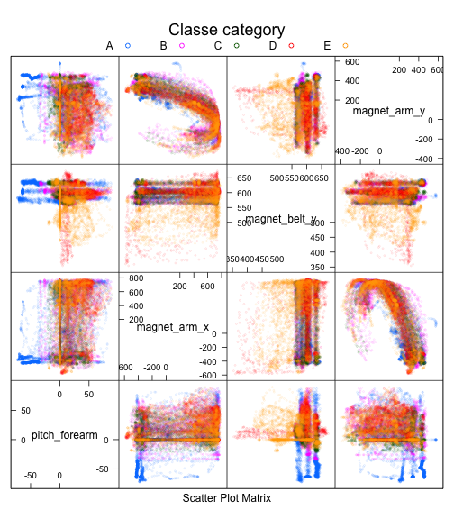
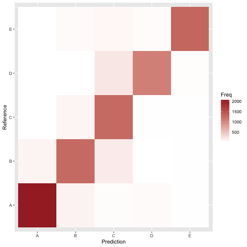
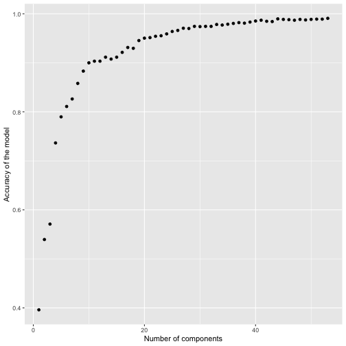
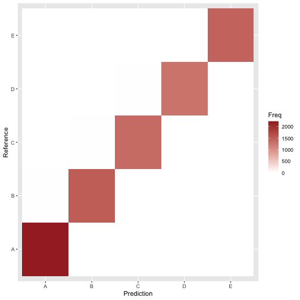

# Executive summary

In this study, we are training a machine learning algorithm in order to predict the performances of an individual in barbell lifting. The set of data we are working with is issued from the [Weight Lifting Exercises Dataset](http://web.archive.org/web/20161224072740/http:/groupware.les.inf.puc-rio.br/har). It can segregate the execution of a barbell lift into 5 categories : while category A is characteristic of a good execution, each category from B to E corresponds to a specific kind of mistake made in the execution. The question here would be how to chose the best algorithm strategy to make these predictions.

First, we considered a quadratic discriminant analysis on the whole set of data. It turned out not to have a sufficiently high sensitivity, hence not being enough for any kind of prediction.

Then we tried to perform the same analysis but with a separate set of data for each individual. This time, the predictions seemed to be good enough although some missing data for Adelmo and Jeremy resulted in a lower accuracy.

Finally, we tried a tree prediction with random forest. It turned out to display an even higher accuracy. The upside was that we only used one model for everybody here instead of having a specific model for each individual as we had done previously.


# Exploratory analysis

### Downloading the data

First we download the csv files. `training0` corresponds to a file in which the data is collected knowing the class category of the execution. Whereas `validation` is a file in which we have the data but no class category associated, and we need to predict it.


```r
## Downloading the data

if (!exists("training0")) {
      download.file("https://d396qusza40orc.cloudfront.net/predmachlearn/pml-training.csv",
                    destfile = "fitbit_training.csv",
                    method = "curl")
      training0 <- read.csv("fitbit_training.csv")
}

if (!exists("validation")) {
      download.file("https://d396qusza40orc.cloudfront.net/predmachlearn/pml-testing.csv",
                    destfile = "fitbit_testing.csv",
                    method = "curl")
      validation <- read.csv("fitbit_testing.csv")
}
```

### Tidying the data

Out of the many parameters in the columns, some have empty values or NAs. We chose to start tidying the data by removing these parameters.


```r
## Uploading the required libraries

library(ggplot2, quietly = TRUE)
library(stats, quietly = TRUE)
library(dplyr, quietly = TRUE)
library(lattice, quietly = TRUE)
library(caret, quietly = TRUE)
library(randomForest, quietly = TRUE)

## Removing the useless parameters

index1 <- as.vector(!sapply (training0, anyNA))
index2 <- as.vector(!sapply (training0, function(x) {any(x=="")}))

training_clean <- training0 [ , index1 & index2]
validation_clean <- validation [ , index1 & index2]
```

### Correlation between the variables

For exploratory analysis purposes, we defined a correlation matrix between the measurement parameters and plotted by pairs on a chart the three parameters with the strongest absolute correlation to the classe.


```r
correlation <- as.data.frame(
      cor (select(training_clean, roll_belt:magnet_forearm_z),
           as.numeric (training_clean$classe)))

correlation <- arrange (correlation, desc(abs(V1)))
head (correlation)
```

```
##                         V1
## pitch_forearm    0.3438258
## magnet_arm_x     0.2959636
## magnet_belt_y   -0.2903491
## magnet_arm_y    -0.2566702
## accel_arm_x      0.2425926
## accel_forearm_x -0.1886854
```

```r
featurePlot (x = training_clean [ , row.names(correlation)[1:4]],
             y = training_clean$classe,
             alpha = 0.1,
             plot = "pairs",
             cex=0.3,
             auto.key = list (space = "top", training_clean$classe, title = "Classe category", columns = 5))
```




Although some patterns appear visible, the dot clouds are too intertwined to only consider these parameters in a simple linear regression model.

### Cross-validation partitioning

We are performing two levels of cross-validation partitioning. The major one consists in dividing the data into a training set (60% of the data) and a testing set (40% of the data) using the `createDataPartition` function in the `caret` package. The training of the algorithms is performed on the training set and the testing set is used to verify the accuracy of the algorithms.
The second level of cross-validation (which is actually the only one necessary) will be performed in the training functions themselves and detailed later on.


```r
## Partition of the training set into training and testing for cross-validation

partition <- createDataPartition (training_clean$classe, p=0.6, list = FALSE)
training <- training_clean [partition, ]
testing <- training_clean [- partition, ]
```

### Constant values in some parameters for Adelmo and Jeremy

Using the `nearZeroVar` function, we managed to discover a few measurement parameters that had no variance for Adelmo (forearm data) and Jeremy (arm data).


```r
list (adelmo = names(training)[nearZeroVar(filter(training, user_name == "adelmo"))][3:5],
      jeremy=names(training)[nearZeroVar(filter(training, user_name == "jeremy"))][3:5])
```

```
## $adelmo
## [1] "roll_forearm"  "pitch_forearm" "yaw_forearm"  
## 
## $jeremy
## [1] "roll_arm"  "pitch_arm" "yaw_arm"
```

# Quadratic Discriminant Analysis

### QDA for all individuals

We chose to perform a quadratic discriminant analysis (qda) because there are more than two final categories in the classe variable, and there is no reason why the parameters should all have the same variance (otherwise linear discriminant analysis would have been optimal). The major upside to using qda is that the outcome can be interpreted as a linear model of the different parameters, and it is possible to define the importance of each variable for each situation.

For the qda model, we train the training set of data for all measurement variables (therefore excluding the user names, time of sessions, windows info or classe category). The training is operated with a cross-validation method with 10 iterations (for a reduction of the bias).


```r
modFit_lda <- train (x = select(training, roll_belt : magnet_forearm_z),
                    y = training$classe,
                    method = "qda",
                    trControl = trainControl(method="cv", number=10))
print(modFit_lda$results[2])
```

```
##    Accuracy
## 1 0.8924944
```

We then verify the accuracy of the model by making a confusion matrix between the predicted results for the testing set and their actual values (it should roughly be identical, that is why we only need one of the two cross-validation method).


```r
prediction <- predict (modFit_lda,
                       newdata = select(testing,roll_belt : magnet_forearm_z))


ggplot (as.data.frame(confusionMatrix (prediction, testing$classe)$table),
        aes(Prediction,Reference)) + 
      geom_tile(aes(fill=Freq)) + 
      scale_fill_gradient(low="white", high="brown")
```



```r
print (confusionMatrix (prediction, testing$classe)$overall[1])
```

```
##  Accuracy 
## 0.8892429
```

We can see here that the accuracy of the model is below 0.95. Therefore, this model is not sufficient for predicting the results. Nevertheless, it is interesting to take a look at the importance of the variables in the model with the `varImp` function. This way, we can obtain the dominant parameter for each class category.


```r
data.frame(classe = c("A","B","C","D","E"),
           main_factor = row.names(varImp(modFit_lda)$importance)
           [apply(varImp(modFit_lda)$importance, 2, which.max)])
```

```
##   classe       main_factor
## 1      A magnet_dumbbell_x
## 2      B     pitch_forearm
## 3      C     magnet_belt_y
## 4      D    pitch_dumbbell
## 5      E     pitch_forearm
```

### QDA for a specific individual

The prediction of the result with a QDA on the total set of data failed to have a sufficiently high accuracy. Now we are going to try QDAs on subsets of data specific to one individual. To do so, we perform a loop for each of the 6 individuals.
We saw in the exploratory analysis part that some of the parameters had a null variance for Adelmo and Jeremy. Here we take this information into account by not selecting the parameters (for one given individual) when their variance is equal to zero.
Then the process is the same as previously, we only retrieve the accuracy value given by the model (which had a 10 fold cross-validation) for every user.


```r
user_names <- as.vector(unique(training$user_name))
accuracy <- data.frame(row.names = "accuracy")

for (i in user_names){

      index_qda <- names (training) %in% 
            names (select (training,
                           roll_belt : magnet_forearm_z,
                           - names(training) [nearZeroVar(filter(training, user_name==i))]))

      modFit_qda <- train (x = select (filter (training, user_name == i), names(training)[index_qda]),
                           y = filter(training, user_name == i)$classe,
                           method = "qda",
                           trControl = trainControl(method="cv",number = 10))

      accuracy [i] <- modFit_qda$results[2]
}
print(accuracy)
```

```
##           carlitos     pedro    adelmo   charles    eurico    jeremy
## accuracy 0.9890768 0.9787301 0.9660774 0.9916687 0.9945023 0.9524356
```

We can see that the lack of information for some of Adelmo and Jeremy's parameters has consequences on the accuracy of the qda model for these people. Otherwise, the accuracy levels are high enough to consider this model. The inconveniance is that we need a separate model for each person, instead of having a general model that takes everything into account.

### Dimension reduction with principle component analysis

One of the advantages of linear models such as lda or qda is that it can easily be coupled with principle component analysis (pca) in the preprocessing. Here we analyse the effect of the number of components used in the training of qda for Carlitos on the accuracy value of the model.


```r
x<-vector(length = 53)
for (i in 1:53){
      training_carlitos <- filter(training,user_name=="carlitos")
      testing_carlitos <- filter(testing,user_name=="carlitos")
      preProc <- preProcess (select(training_carlitos,roll_belt : magnet_forearm_z), method="pca", pcaComp = i)
      training_carlitos_pca<-predict(preProc,select(training_carlitos,roll_belt : magnet_forearm_z))
      modFit <- train (x=training_carlitos_pca,
                       y=training_carlitos$classe,
                       method="qda",
                       trControl = trainControl(method="cv",number = 10))
      x[i]<-as.numeric(modFit$results[2])
}

qplot(1:53, x) + xlab("Number of components") + ylab("Accuracy of the model")
```



The accuracy of the model reaches 95 % only when we choose at least 20 components. This means that there is no simple description of the model with only a few variables.

# Random Forest Analysis

We managed to find a way to predict the result with quadratic discriminent analysis. But these analyses required one different model for each individual, which is not really convenient. We are now going to try a Random Forest Analysis on the data.


```r
## Random Forest on training set

modFit_rf <- randomForest (x = select(training, roll_belt : magnet_forearm_z),
                        y = training$classe)

print(modFit_rf$err.rate[500,1])
```

```
##       OOB 
## 0.0078125
```

`OOB` is the out of bag estimate of error rates of the model. A low value like the one we are obtaining is an indicator of good predictive value for our model. We check this with our usual cross-validation :


```r
prediction <- predict (modFit_rf,
                       newdata=select(testing,roll_belt : magnet_forearm_z))

ggplot (as.data.frame(confusionMatrix (prediction, testing$classe)$table),
        aes(Prediction,Reference)) + 
      geom_tile(aes(fill=Freq)) + 
      scale_fill_gradient(low="white", high="brown")
```



```r
print (confusionMatrix (prediction, testing$classe)$overall[1])
```

```
##  Accuracy 
## 0.9951568
```

The accuracy of the algorithm is even higher with random forest than it is with quadratic discriminant analysis by individual. We chose to keep this random forest algorithm as the most effective model for implementing our data.

# Prediction for the validation data

Using the random forest algorithm we developped, we are now able to predict the class category for the validation data.


```r
## Prediction for validation

print(predict (modFit_rf, newdata=select(validation_clean, roll_belt : magnet_forearm_z)))
```

```
##  1  2  3  4  5  6  7  8  9 10 11 12 13 14 15 16 17 18 19 20 
##  B  A  B  A  A  E  D  B  A  A  B  C  B  A  E  E  A  B  B  B 
## Levels: A B C D E
```
